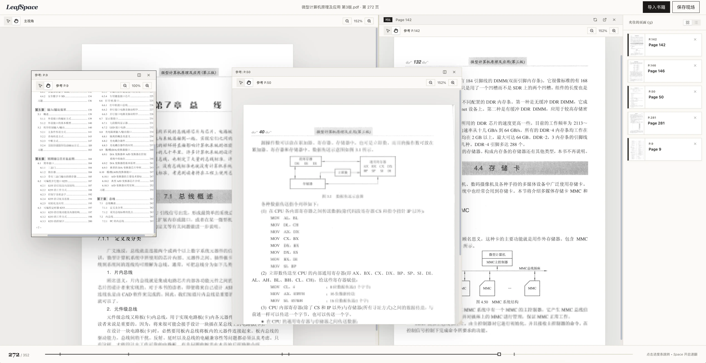
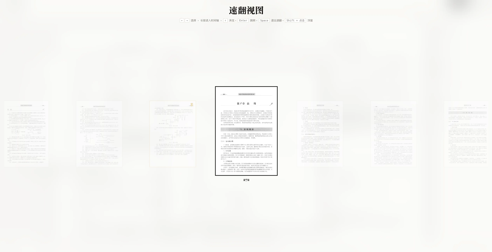

# LeafSpace (页境)

> **"Read like paper, efficient like a workstation."**
> 让线性翻页，升级为空间化研读。

LeafSpace 是一款专为扫描版 PDF 打造的「纸感工作区」阅读器。它打破了传统 PDF 阅读器线性的翻页限制，引入了「阅览态-导航态-工作区」三态协同的交互模型，致力于为学术研读、深度学习和复杂文档处理提供极致的效率体验。

## Overview

LeafSpace 围绕三种状态组织交互：

- **Reader**：用于连续阅读、缩放、翻页和保持纸面感。
- **Quick Flip & Held Pages**：用于快速建立全书位置感，找到并“夹住”关键页面。
- **Workspace**：用于把关“夹住”的页面展开到并行窗口中，对照、拆分和恢复现场。

专注于扫描书籍、档案材料等的类纸翻阅体验。

## Screenshots

主阅读与工作区：



速翻视图：



## Features

- **Paper-first reading**：保持接近纸面阅读的视觉节奏与布局感，不把界面做成以工具栏为中心的操作台。
- **Quick Flip navigation**：通过缩略图条带与时间轴快速定位长文档中的目标页，减少线性翻页成本。
- **Held pages**：将关键页面临时夹住，形成一条可回访的参考列表。
- **Workspace canvas**：把页面打开为主视图、浮窗或分栏，用于平行阅读与内容比对。
- **Session restore**：为单本书保存当前页、缩放、夹页和窗口布局，在下次打开时恢复现场。
- **Thumbnail pipeline**：通过缓存、懒加载和 worker 渲染控制缩略图开销，保证大文档下的交互稳定性。

## Interaction model

当前版本中，几个核心操作可以串成一条连续路径：

1. 在主视图中阅读并缩放页面。
2. 按 `Space` 进入速翻视图，快速跳到目标区域。
3. 用 `↑` 将关键页面夹住，必要时通过 `Shift + 点击` 或工作区打开为参考窗口。
4. 返回主视图继续阅读，并在底部时间轴与右侧夹页列表中维持上下文。

LeafSpace 的设计重点不是增加尽可能多的功能点，而是让这些动作之间的切换成本足够低。


## Getting started

目前已部署在 Cloudflare Pages，可以[在线体验](https://leafspace.kanglives.top)。

如果想本地运行：

### Requirements

- Node.js 20+
- npm 10+

### Install

```bash
npm install
```

### Run locally

```bash
npm run dev
```

### Build

```bash
npm run build
```

### Test

```bash
npm run test:unit
npm run test:ui
npm run test:e2e
```

## Repository guide

- [src/components](src/components) contains the main UI surfaces, including reader, quick flip, timeline, held pages, and workspace canvas.
- [src/services](src/services) contains PDF, persistence, and thumbnail pipeline logic.
- [src/stores](src/stores) contains Zustand stores for document, window, thumbnail, quick flip, and workspace state.

---

*页境：既是页与页之间的空间，也是用户建立知识地图的阅读环境。*
