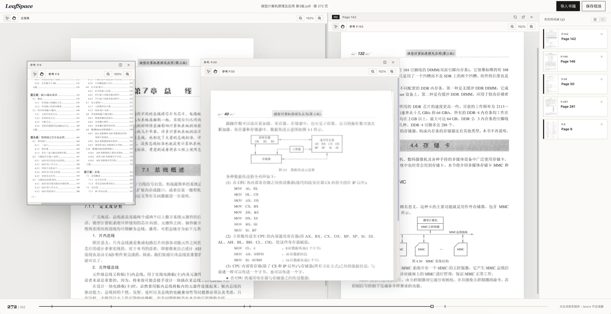
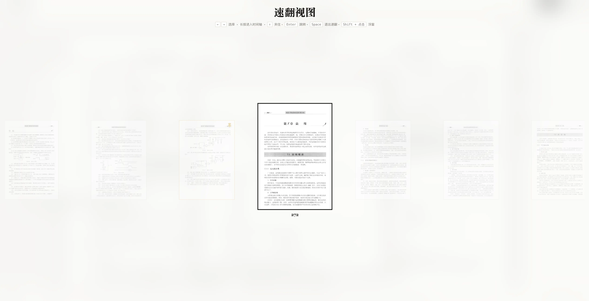

# LeafSpace (页境)

> **"Read like paper, efficient like a workstation."**
> 让线性翻页，升级为空间化研读。

LeafSpace 是一款专为扫描版 PDF 打造的「纸感工作区」阅读器。它打破了传统 PDF 阅读器线性的翻页限制，引入了「阅览态-导航态-工作区」三态协同的交互模型，致力于为学术研读、深度学习和复杂文档处理提供极致的效率体验。

## Overview

LeafSpace 围绕三种状态组织交互：

- **Reader**：用于连续阅读、缩放、翻页和保持纸面感。
- **Quick Flip & Held Pages**：用于快速建立全书位置感，找到并“夹住”关键页面。
- **Workspace**：用于把关“夹住”的页面展开到并行窗口中，对照、拆分和恢复现场。

专注于扫描书籍、档案材料等的类纸翻阅体验。

## Screenshots

主阅读与工作区：



速翻视图：



## Features

- **Paper-first reading**：保持接近纸面阅读的视觉节奏与布局感，不把界面做成以工具栏为中心的操作台。
- **Quick Flip navigation**：通过缩略图条带与时间轴快速定位长文档中的目标页，减少线性翻页成本。
- **Held pages**：将关键页面临时夹住，形成一条可回访的参考列表。
- **Workspace canvas**：把页面打开为主视图、浮窗或分栏，用于平行阅读与内容比对。
- **Session restore**：为单本书保存当前页、缩放、夹页和窗口布局，在下次打开时恢复现场。
- **Thumbnail pipeline**：通过缓存、懒加载和 worker 渲染控制缩略图开销，保证大文档下的交互稳定性。

## Interaction model

当前版本中，几个核心操作可以串成一条连续路径：

1. 在主视图中阅读并缩放页面。
2. 按 `Space` 进入速翻视图，快速跳到目标区域。
3. 用 `↑` 将关键页面夹住，必要时通过 `Shift + 点击` 或工作区打开为参考窗口。
4. 返回主视图继续阅读，并在底部时间轴与右侧夹页列表中维持上下文。

LeafSpace 的设计重点不是增加尽可能多的功能点，而是让这些动作之间的切换成本足够低。


## Getting started

目前已部署为 Cloudflare Workers 静态站点，可以[在线体验](https://leafspace.kanglives.top)。

如果想本地运行：

### Requirements

- Node.js 22.12+
- npm 10+

### Install

```bash
npm install
```

### Run locally

```bash
npm run dev
```

### Build

```bash
npm run build
```

### Test

```bash
npm run test:unit
npm run test:ui
npm run test:e2e
```

## Repository guide

- [src/components](src/components) contains the main UI surfaces, including reader, quick flip, timeline, held pages, and workspace canvas.
- [src/services](src/services) contains PDF, persistence, and thumbnail pipeline logic.
- [src/stores](src/stores) contains Zustand stores for document, window, thumbnail, quick flip, and workspace state.

---

*页境：既是页与页之间的空间，也是用户建立知识地图的阅读环境。*

## 阅读与恢复

- 点击「速翻」或在阅读区按 `Space` 预览其他页面；`Esc` 取消，`Enter` 或「阅读此页」确认跳转
- 阅读区 `←` / `→` 翻页，`↑` 夹住当前页；鼠标滚轮和触摸滚动页面，`Ctrl` / `⌘` + 滚轮缩放
- 夹页单击回到当前焦点阅读区；桌面鼠标双击、Shift + 点击或对照图标打开参考窗口。触屏和小屏抽屉用单次点按阅读、对照图标开窗。主阅读窗口不可关闭
- 触屏长按速翻或夹页缩略图，可选择阅读、打开参考窗或管理夹页；先松开手指，再点选操作。移动、滚动或第二根手指会取消等待中的长按；取消菜单不会跳页
- 慢速鼠标双击也会保留原阅读窗口的页码、缩放和滚动位置；等待单击生效时若已执行新导航，不会再跳回旧操作选中的页面
- 取消移除夹页会回到原按钮；移除后会聚焦相邻夹页。关闭参考窗口后可直接用键盘继续阅读
- 浮窗拖动、缩放和分栏调整在失焦、切换标签页或松开鼠标时结束；拖动中按 Esc 只取消本次拖动，不关闭窗口
- 最多新建 4 个参考窗口。可选择并排或平铺 2–5 页；手机通过「打开的页面」切换主视角与参考页
- 速翻、目录、底部时间轴和页码输入跟随当前活动窗口。页码输入按 Enter 确认，Esc 取消
- 最多新增到 12 张夹页，可通过上下移动按钮调整顺序；移除正在对照的夹页时可选择是否保留窗口
- 点击左上角 LeafSpace 回到书库。切换书籍、回到书库前，会先保存当前现场
- 页码、缩放、夹页与窗口布局在操作停止后自动保存；切到后台时会尽早尝试保存待存更改。只有真正保存完成才显示「已保存到本机」。存储失败或上次现场未恢复时仍需明确重试，后台保存不能保证在系统结束进程前完成
- 有尚未保存的阅读更改、进行中或失败的保存、未保存的 PDF 时，刷新或关闭页面会请求浏览器离开确认；保存成功后不再提示。浏览器控制提示文字与显示条件，手机进程被结束时可能不会提示，请保留原 PDF
- 若 PDF 本机副本保存失败，可继续阅读并「重试保存」；系统会先补存原 PDF，再保存最新现场，不会悄悄丢下无法重新打开的书籍
- 若上次现场读取失败，切换书籍和返回书库不会覆盖它。可重试恢复；选择「保存现场」时需明确确认是否用当前现场替换
- 关闭错误提示后，顶部「查看问题」可重新打开原有说明和重试入口；查看说明不会自动重试或覆盖现场
- 若单页绘制失败，阅读区会显示「重试此页」；明确重试只重新绘制这一页，保留书籍、缩放、夹页与窗口现场，也可以直接翻到其他页继续阅读
- 最近列表展示 3 本书，但不会删除更早书籍的 PDF 或阅读现场；重新导入同一本 PDF 可恢复
- 文件在当前浏览器中处理，阅读现场保存在 IndexedDB。清除浏览器数据会清除本机副本；请保留原 PDF
- 常规自动保存只写阅读现场和轻量书籍信息，不会反复重写整份 PDF；旧书的信息按需补建
- 本机存储升级不会搬移或转换已有 PDF。若新增信息表暂时无法建立，旧书和阅读现场仍可读取，保存成功前会保留错误提示

## Quality checks

```bash
npm ci
npm run lint
npm run build
npm run test:unit
npm run test:ui
npx playwright install --with-deps chromium firefox webkit
npm run test:e2e
```

`Product quality` GitHub Actions runs the same checks and uploads Playwright reports, failure traces and real desktop/tablet/mobile screenshots as `leafspace-browser-evidence-<engine>`. Browser engines run in independent CI jobs; WebKit uses one worker to avoid competing native focus. Browser fixtures are small, generated PDFs, never personal documents. The configured matrix runs Chromium, Firefox and WebKit at 1440×900, plus Chromium at 768×1024 and 390×844. The exact commit’s Actions report is authoritative; WebKit automation is not a claim of real iPhone/iPad coverage.

See [browser coverage and evidence](src/tests/e2e/README.md) for scenarios and artifact interpretation.

### Site icons

`public/leafspace-icon-v1.svg` is the source for the paper-leaf mark. Run `npm run icons:generate` to regenerate the 16/32/48 px ICO, PNG browser fallback, and opaque 180/192/512 px home-screen icons. When changing the design, bump the versioned filenames, manifest links, and favicon query in `index.html` together so browsers request the new artwork. The manifest keeps browser launch mode; it does not add offline caching or a service worker.

### Touch and timeline navigation

- In grab mode, a deliberate left/right swipe turns the touched reader page when its paper fits horizontally. At zoom overflow, one finger pans naturally instead; vertical scrolling and text selection remain native.
- Two fingers on the same reader preview a paper zoom, then commit at release around the fingers' midpoint. Cancelled/interrupted gestures leave the saved scale unchanged. Reader zoom remains independent per window; browser pinch zoom is available outside the reader.
- Drag the footer timeline to preview a page number without changing or saving the reading position. Release to jump, or move vertically away from the track and release to cancel (move back to resume). Escape/Space also cancels. Keyboard arrows and track clicks still navigate directly. Changing book/window or leaving the interaction cancels its temporary selection.
- CI includes Chromium native CDP touch input at tablet/mobile viewports and cross-engine event-contract tests, including iPhone-sized WebKit emulation. This does not claim physical iOS hardware validation.

### Document resource retirement

Returning to the library or starting another book synchronously releases LeafSpace's cached PDF source and thumbnail URLs. Each opening owns a distinct thumbnail session, including same-book reopenings; stale callbacks cannot publish into the new session. Custom thumbnail workers terminate at retirement.

Main-thread thumbnail fallback uses one parser slot. A retired parse/page operation must settle before safe PDF.js disposal; fresh fallback requests fail gracefully with the existing preview retry UI while that slot is occupied. This bounds accumulation, not cleanup duration. The reader's React-PDF ownership is unchanged; this does not claim to fix the independently reproduced PDF.js rejection when destroying a pending parse. No durable PDF or workspace records are deleted by resource cleanup.
